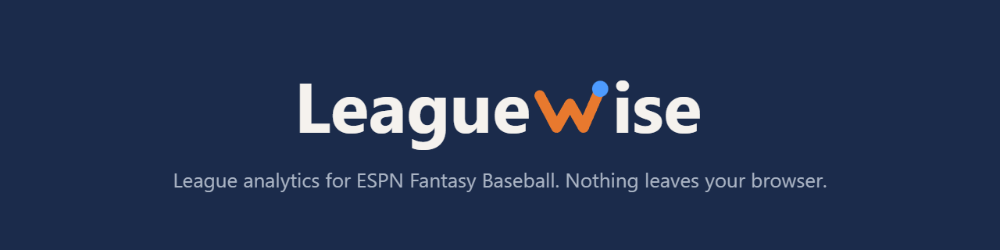
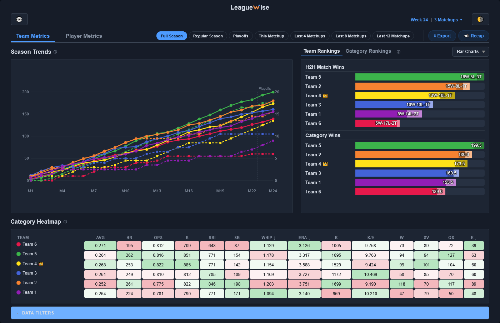
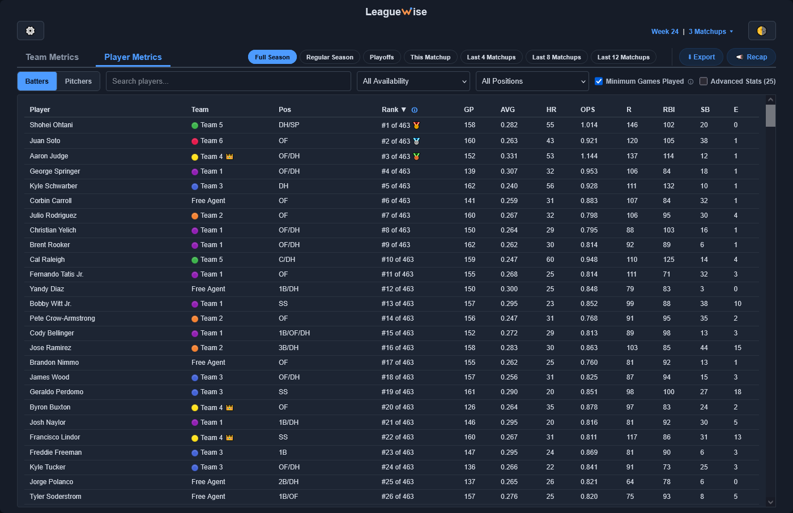

<p align="center"></p>

<p align="center">A browser extension. Firefox today, with Chrome and Edge on the way.</p>

Standings, trend lines, category heatmaps, a ranked player leaderboard, and shareable weekly recaps for your ESPN Fantasy Baseball league. Category leagues are fully supported today. Hockey and points leagues are in progress.

## Built with AI, reviewed by humans

AI does a lot of the typing here. Humans review and test every change before it lands. The unit tests assert hand-computed values, and all ESPN stat ids are checked against real stat lines before use.

If AI involvement bothers you, fair enough. The entire source is here to read, and it's small.

## Your data stays in your browser

- No backend, no servers. The extension runs entirely in your browser.
- It talks to exactly one place: ESPN's fantasy API, using the ESPN login already in your browser.
- No analytics, telemetry, or tracking.
- Three permissions: `cookies` (your ESPN session), `storage` (your settings), `clipboardWrite` (the export button).
- No dependencies, no build step. The code in this repository is the code that runs.

## What it does

- **Team Metrics**: standings with playoff shading, season trend lines, category rankings, a category heatmap, live weekly scoreboards, and a shared timeframe control (full season, regular season, last N matchups, playoffs).

<p align="center"></p>

- **Player Metrics**: every player in your league ranked by percentile in your league's own categories, adjusted for playing time, with search and position filters and per-player weekly trend charts.

<p align="center"></p>

- **Export and Recap**: CSV or clipboard export of any view, and a shareable image recap of a matchup week for the league group chat.

## Install

Chrome and Edge builds are in progress. These steps cover Firefox for now.

1. Clone this repository.
2. In Firefox, go to `about:debugging#/runtime/this-firefox`, click **Load Temporary Add-on**, and select `manifest.json` from the clone.
3. Click the extension icon, enter your league's sport, ID, and year, and hit **Fetch Data**.

Temporary add-ons are removed when Firefox restarts.

## Dev preview (no ESPN account needed)

`dev-preview.html` runs the full dashboard against a bundled anonymized sample league, with the WebExtension APIs stubbed:

```
python -m http.server 8123
```

Then open `http://localhost:8123/dev-preview.html`. It has to be served over `http://` because ES module imports won't load from `file://`.

To use your own league's data: load the real extension, download a JSON dump from the Diagnostic Data panel, put it in a `JSON_debug/` folder at the repository root, and pick it with `?payload=<filename>`. That folder is gitignored because it holds real league data. Don't commit it.

## Tests

In-browser unit tests, no test runner. Open them through the same server:

- `http://localhost:8123/tests/rank-engine.test.html`
- `http://localhost:8123/tests/features.test.html`

A green header means everything held.

## Stack

Vanilla ES modules, one CSS file, no framework, no build step, no dependencies.

## Work in progress

- **Hockey.** The plumbing exists but hasn't been validated against a live season.
- **Points leagues.** Same story. If you run one and want it sooner, open an issue.
- **Chrome and Edge builds.**
- **Firefox for Android.**

## Contributions

Outside contributions aren't being accepted right now. Issues are welcome.

## License

See `LICENSE` (Mozilla Public License 2.0).
