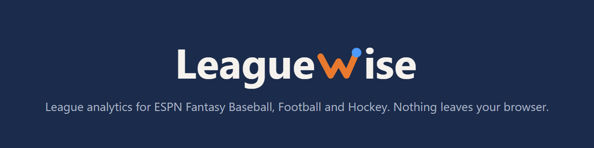
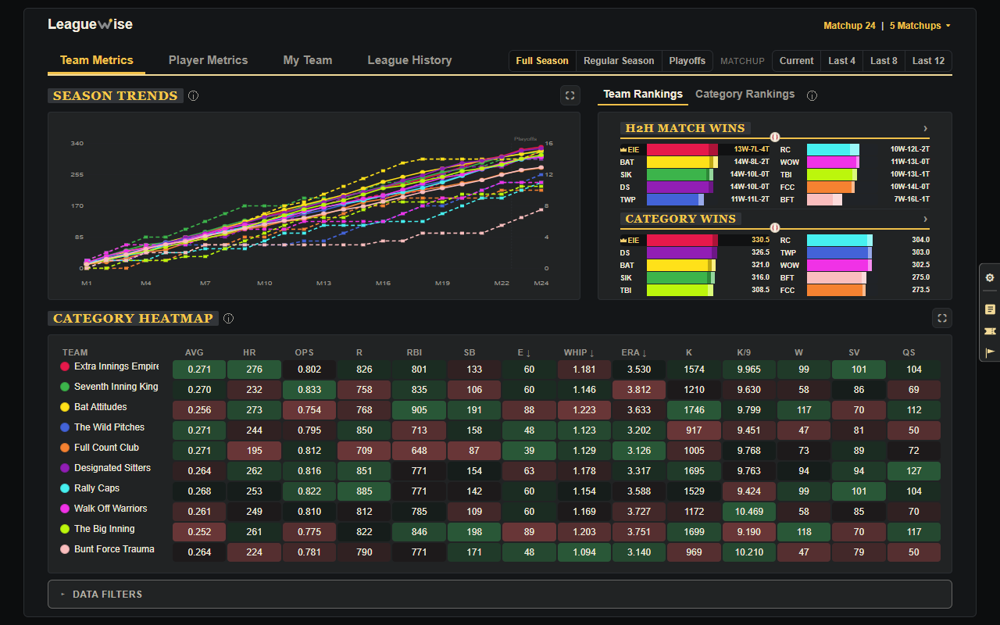
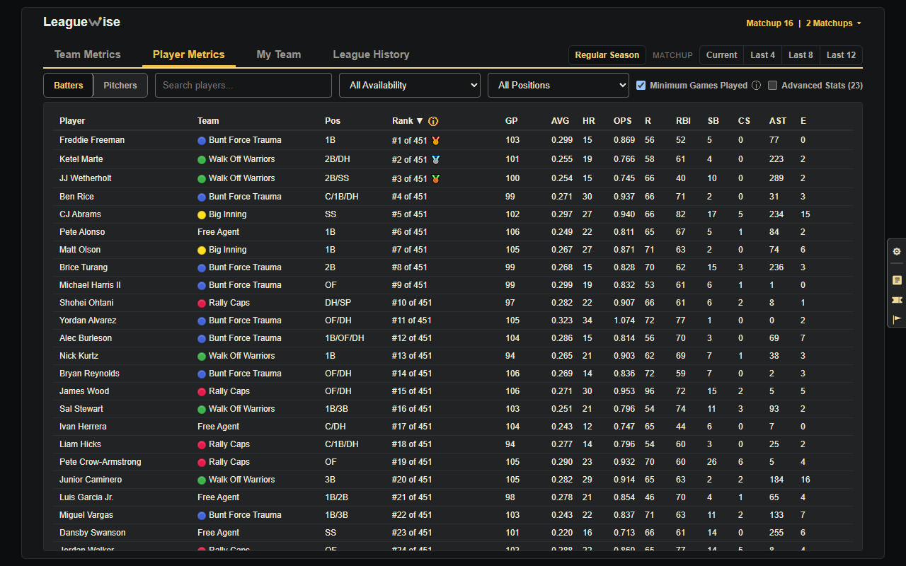
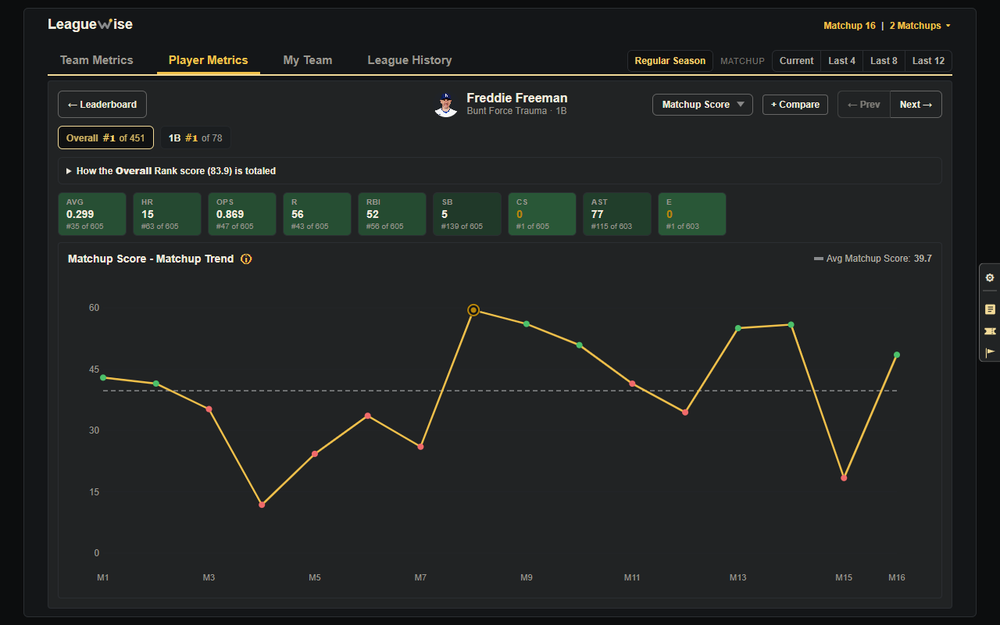
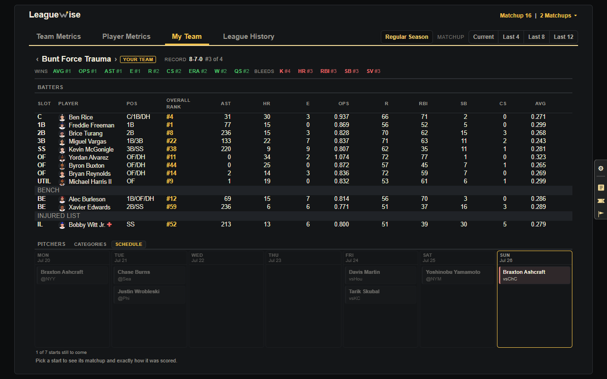
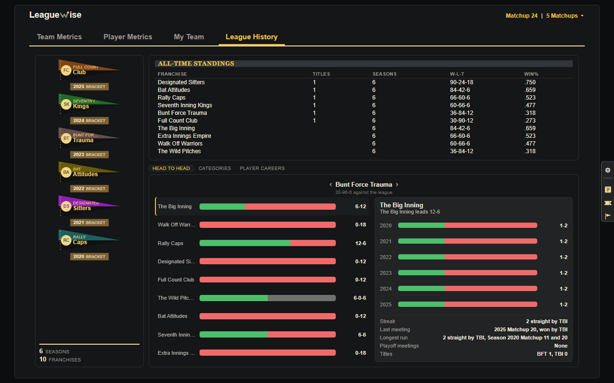

<p align="center"></p>

<p align="center">A browser extension for Firefox and Chrome.</p>

<p align="center">
  <a href="https://addons.mozilla.org/en-US/firefox/addon/leaguewise/"></a>
  <a href="https://chromewebstore.google.com/detail/leaguewise/emnepcdlpnnphjgfiajhkciijciifdoj"></a>
</p>


Analytics for your ESPN Fantasy Baseball and Hockey league: how every team is doing, how every player rates, and everything the league has ever done. Head to head, points, and roto formats are all supported.

## Built with AI, reviewed by humans

AI is actively used for developing and maintaining this project. Humans review and test every change before it lands.

## Your data stays in your browser

- No backend, no servers. The extension runs entirely in your browser.
- Your data never leaves your browser. Your league info comes from ESPN's fantasy API, using login already in your browser. Player photos come from ESPN's image CDN.
- No analytics, telemetry, or tracking.
- Three permissions: `cookies` (your ESPN session), `storage` (your settings), `clipboardWrite` (the export button).
- No dependencies, no build step. The code in this repository is the code that runs.

## What it does

Each tab provides a different view into your league.

- **Team Metrics**, how the league is doing. Season trend lines, per-category rankings, a category heatmap, and live scoreboards for the matchup being played.

<p align="center"></p>

- **Player Metrics**. Every player in your league ranked in your league's own categories. Open any player for a more in depth view and player comparisons.

<p align="center"></p>

<p align="center"></p>

- **My Team**, your roster at a glance. Every player with their rank and category line. Pitchers have a schedule view with projected matchup difficulties based on the opponent's batting and park factor.

<p align="center"></p>

- **League History**, everything the league has ever done. Every season it has played, with the champions down the side as pennants for baseball and rafter banners for hockey.


<p align="center"></p>

One timeframe control drives Team Metrics, Player Metrics, and My Team. Pick a part of the season you want to see in more detail.

Two looks, Boxscore and Modern, each in light and dark, under Display in the settings.

- **Export and Recap**: CSV or clipboard export of any view, and a shareable image recap of a matchup week for the league group chat.

## Install

**[Add to Firefox](https://addons.mozilla.org/en-US/firefox/addon/leaguewise/)** or **[Add to Chrome](https://chromewebstore.google.com/detail/leaguewise/emnepcdlpnnphjgfiajhkciijciifdoj)**.

Click the extension icon, enter your league's sport, ID, and year, and hit **Fetch Data**.

For development, load it temporarily instead: in Firefox, go to `about:debugging#/runtime/this-firefox`, click **Load Temporary Add-on**, and select `manifest.json` from a clone. Temporary add-ons are removed when Firefox restarts.

## Dev preview (no ESPN account needed)

`dev-preview.html` runs the full dashboard against a bundled anonymized sample league, with the WebExtension APIs stubbed:

```
python -m http.server 8123
```

Then open `http://localhost:8123/dev-preview.html`. It has to be served over `http://` because ES module imports won't load from `file://`.

To use your own league's data: load the real extension, download a JSON dump from the Diagnostic Data panel, put it in a `JSON_debug/` folder at the repository root, and pick it with `?payload=<filename>`. That folder is gitignored because it holds real league data. Don't commit it.

## Tests

In-browser unit tests, no test runner. Open them through the same server:

- `http://localhost:8123/tests/rank-engine.test.html`
- `http://localhost:8123/tests/features.test.html`

A green header means everything held.

## Stack

Vanilla ES modules, one CSS file, no framework, no build step, no dependencies.

## Releases

What changed in each release is in the [changelog](CHANGELOG.md).

## Work in progress

- **Microsoft Edge.**
- **Firefox for Android.**

## License

See `LICENSE` (Mozilla Public License 2.0).

See [DISCLAIMER.md](DISCLAIMER.md).
